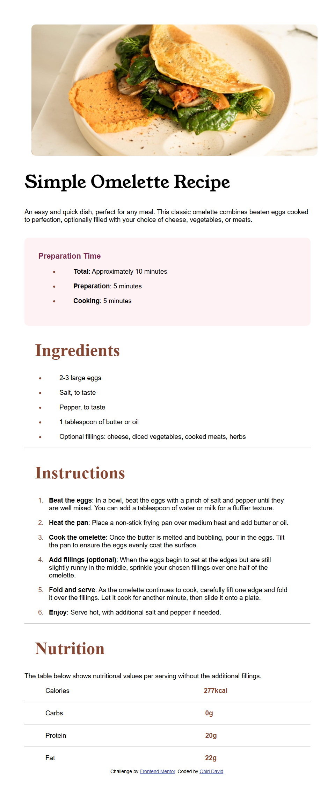

---
# Frontend Mentor - Recipe Page Solution

This is my solution to the [Recipe Page Challenge on Frontend Mentor](https://www.frontendmentor.io/challenges/recipe-page-KiTsR8QQKm). These challenges are great for improving coding skills by working on realistic projects.
---

## Table of Contents

- [Overview](#overview)
  - [The Challenge](#the-challenge)
  - [Screenshot](#screenshot)
  - [Links](#links)
- [My Process](#my-process)
  - [Built With](#built-with)
  - [What I Learned](#what-i-learned)
  - [Continued Development](#continued-development)
  - [Useful Resources](#useful-resources)
- [Author](#author)
- [Acknowledgments](#acknowledgments)

---

## Overview

### The Challenge

Create a visually appealing and responsive recipe page with HTML, CSS, and JavaScript, meeting the provided design and functionality specifications.

### Screenshot



### Links

- **Solution URL:** [View my solution here](https://github.com/isnirvana/Recipe-app)
- **Live Site URL:** [See the live site here]([https://your-live-site-url.com](https://recipe-app-frontendmentor.netlify.app/))

---

## My Process

### Built With

- Semantic HTML5 markup
- CSS custom properties
- Flexbox

### What I Learned

This project helped me strengthen my understanding of responsive design and modern web development techniques. Below are some highlights:

#### Code Snippets

Example of a semantic HTML structure:

```html
<body>
  <h1 class="heading">Simple Omelette Recipe</h1>
</body>
```

Example of a CSS snippet for styling:

```css
body {
  margin: 3.5rem;
  padding: 0;
  font-size: 15px;
  background-color: hsl(0, 0%, 100%);
}
```

### Continued Development

In future projects, I plan to focus on:

- Further mastering CSS Grid for complex layouts.
- Enhancing accessibility (ARIA roles and keyboard navigation).
- Exploring advanced animations using CSS and JavaScript.

### Useful Resources

- [CSS Tricks](https://css-tricks.com/) - Great resource for learning and troubleshooting CSS.
- [MDN Web Docs](https://developer.mozilla.org/) - Comprehensive documentation for web technologies.
- [Frontend Mentor Community](https://www.frontendmentor.io/community) - Helpful for feedback and insights.

---

## Author

- **Frontend Mentor Profile:** [@isnirvana](https://www.frontendmentor.io/profile/isnirvana)
- **Twitter:** [@isnirvana](https://www.twitter.com/isnirvana)

---

## Acknowledgments

Special thanks to the Frontend Mentor community for their feedback and inspiration during this challenge.

---
